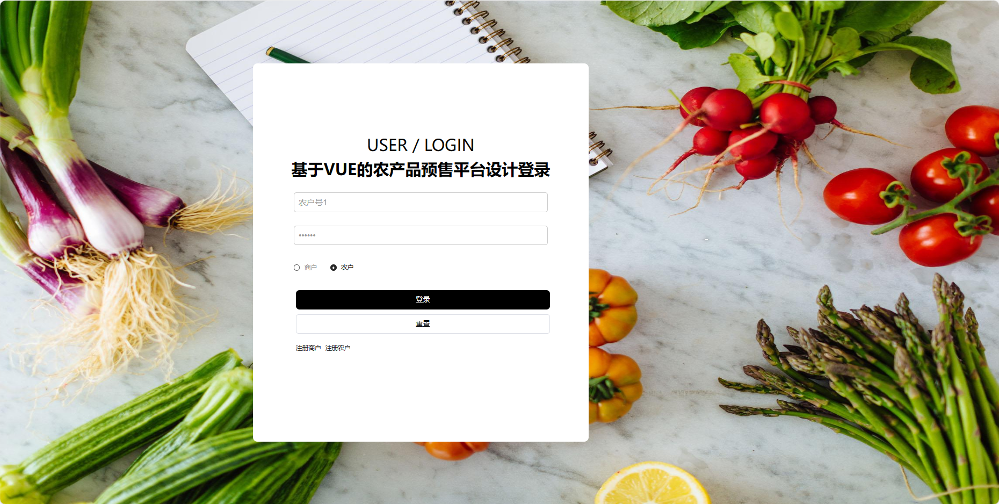
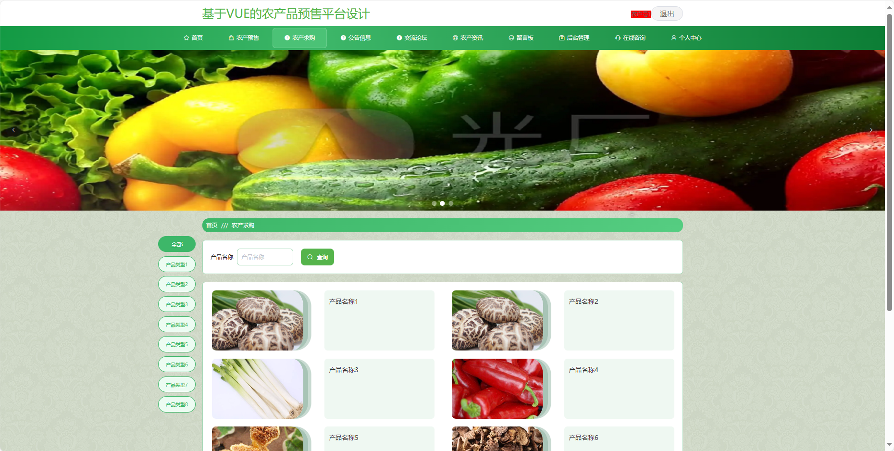
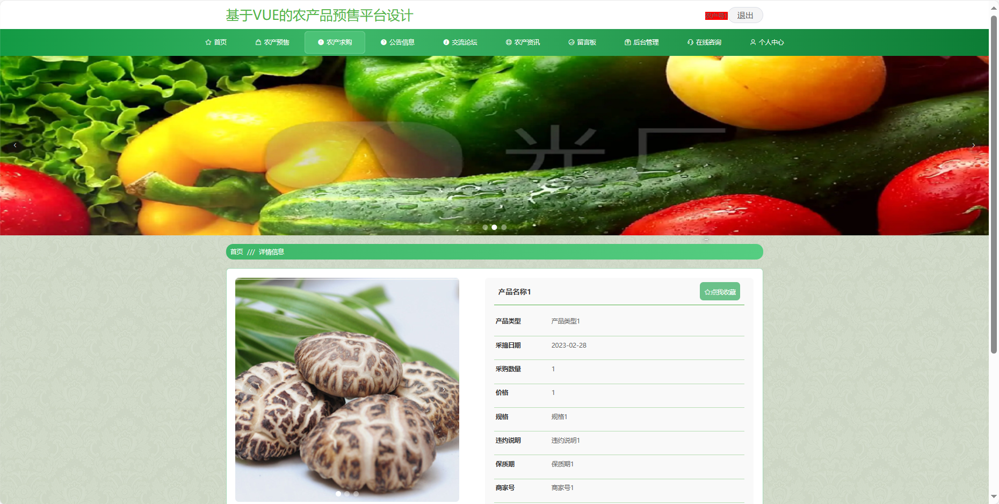
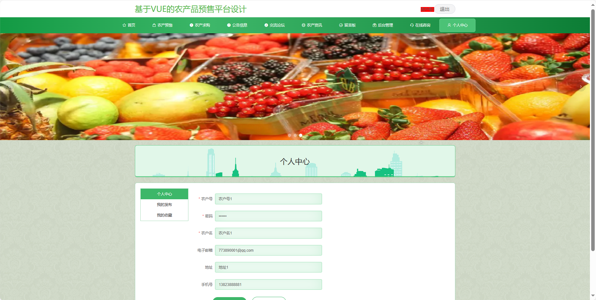

基于Springboot的农产品预售平台
=
### 完整代码获取地址：从戎源码网 ([https://armycodes.com/](https://armycodes.com/))
### 作者微信：19941326836  QQ：952045282 
### 承接计算机毕业设计、Java毕业设计、Python毕业设计、深度学习、机器学习
### 选题+开题报告+任务书+程序定制+安装调试+论文+答辩ppt 一条龙服务
### 所有选题地址https://github.com/nature924/allProject

一、项目介绍
---
基于Spring Boot框架实现的农产品预售平台，系统包含三种角色：管理员、农民,商家主要功能如下。

### 【农民功能】

首页：展示平台的基本信息。
农产预售：发布农产品预售信息。
农产求购：发布对特定农产品的求购需求。
公告信息：查看平台发布的相关公告和通知。
交流论坛：参与用户间的交流和讨论。
农产资讯：浏览与农业相关的新闻和资讯。
留言板：留下对特定信息或农产品的留言。
后台管理：管理个人发布的信息编辑、删除等操作。
在线咨询：与平台管理员进行在线沟通和咨询。
个人中心：管理个人信息、发布的信息记录等。

### 【管理员功能】

系统首页：查看平台整体概况。
个人中心：管理个人信息。
商户管理：管理注册商家的基本信息。
农户管理：管理注册农民的基本信息。
产品类型管理：管理农产品的分类信息。
农产预售管理：监管和管理农产预售信息。
预订农产管理：处理用户对农产品的预订请求。
商家违约管理：处理商家涉及的违约情况。
预售尾款管理：管理用户对预售农产品的尾款支付。
农产求购管理：监管和管理农产求购信息。
农产登记管理：审核和管理农产品的登记信息。
农户违约管理：处理农户涉及的违约情况。
求购尾款管理：管理用户对求购农产品的尾款支付。
公告信息管理：发布、编辑和删除平台公告。
留言板：查看和管理用户在留言板上的留言。
交流论坛：监管和管理交流论坛的内容。
系统管理：管理系统的基本设置和运行参数。

### 【商家功能】

首页：展示平台的基本信息。
农产预售：发布农产品预售信息，。
农产求购：发布对特定农产品的求购需求。
公告信息：查看平台发布的相关公告和通知。
交流论坛：参与用户间的交流和讨论。
农产资讯：浏览与农业相关的新闻和资讯。
留言板：留下对特定信息或农产品的留言。
后台管理：管理个人发布的信息，编辑、删除等操作。
在线咨询：与平台管理员进行在线沟通和咨询。
个人中心：管理个人信息、发布的信息记录等。

二、项目技术
---
- 编程语言：Java
- 数据库：MySQL
- 项目管理工具：Maven
- 前端技术：VUE、HTML、Jquery、Bootstrap
- 后端技术：Spring、SpringMVC、MyBatis

三、运行环境
---
- 操作系统：Windows、macOS都可以
- JDK版本：JDK1.8以上都可以
- 开发工具：IDEA、Ecplise、Myecplise都可以
- 数据库: MySQL5.7以上都可以
- Tomcat：任意版本都可以
- Maven：任意版本都可以

四、运行截图
---

### 程序截图：

